# CS 4641 Project Proposal
## Introduction/Background
The frequency and severity of wildfires are predicted to increase in the upcoming years due to climate change [6]. This predicted increase in wildfires has led to more AI research regarding wildfires. Models have been created to predict high-risk areas for wildfires based on factors such as an area’s climate and vegetation. Additionally, researchers at Stanford University developed a model that shows how wildfires affect air quality [3]. Our dataset contains 22,710 aerial images of areas that have been affected by wildfires and 20,140 aerial images of areas that have not been affected by wildfires [1]. The images in our dataset contain different features, such as streets, buildings, forests, and lakes. 
## Problem Definition
To predict whether a land area is at risk for a wildfire, we will use machine learning to classify satellite images of areas that have previously experienced wildfires. According to the World Health Organization, 6.2 million people were affected by wildfires–including 2400 deaths– between 1998 and 2017 [8]. Exposure to wildfires ruins community infrastructure, releases dangerous levels of air pollutants, and can result in a financial loss of several million dollars for a community. In addition, it has been shown that a previous forest fire can impact the probability and severity of another forest fire in the same region [4]. Classifying images of areas that have previously had wildfires will determine fire-prone regions. Accurate prediction of wildfires will help communities evacuate earlier and increase intervention response speed.  
## Methods
### Data Collection
The data that will be used is called the Wildfire Prediction Dataset. The data contains images corresponding to two classes (wildfire or no wildfire). The data that will be used is adapted from datasets released by the Canadian Forest Inventory Department (DIF) and Forest Protection Department (DPF) ([link](https://open.canada.ca/data/en/dataset/9d8f219c-4df0-4481-926f-8a2a532ca003)). See four examples of images below:

  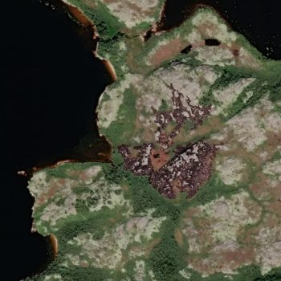
  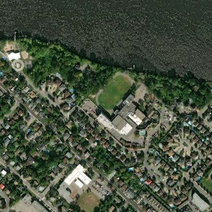 
  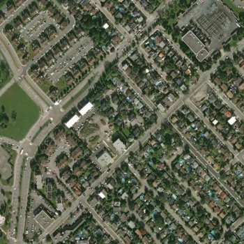
  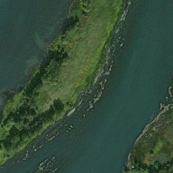 

 

### Data Preprocessing
The data is already in subsets of training, validation, and testing sets, sorted according to the hierarchy of directories below, where the percent of the category’s wildfire images and no wildfire images are shown too:

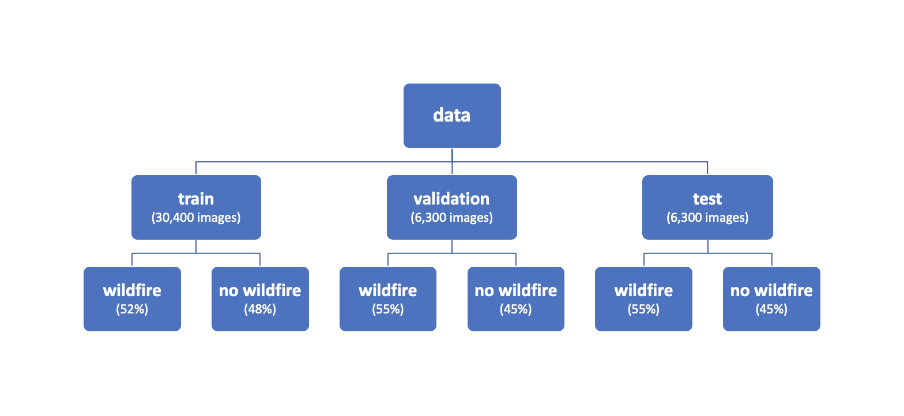

As our training dataset includes 30,400 350x350 pixel images, we must reduce training time. To do so, our team performed dimensionality reduction via PCA. We used PCA for image compression to determine the number of dimensions (principal components) necessary to maintain enough variance in the data. Below is a scree plot showing the positive correlation between the number of principal components and the experienced variance.

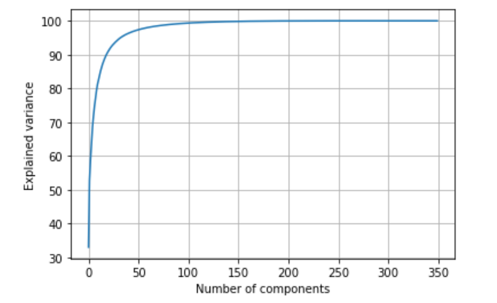

We performed PCA on a random sample of 100 training images from both the wildfire class and the no-wildfire class. We split the image into three red, green, and blue channels and then applied PCA on a specific number of principal components (iterating from 25 to 350) on each channel. Below are two examples of the progression of image compression:

Example 1:
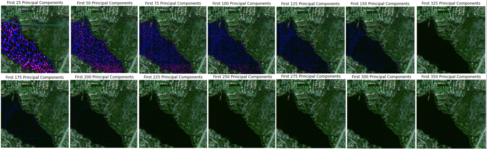

Example 2:
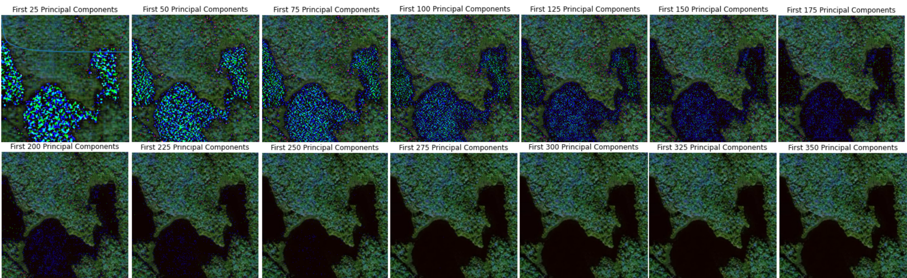

For each image in the random sample, we determined the number of principal components required to maintain certain variances. Below is the average number of principal components required at different levels of maintained variance based on the 100 image random sample:

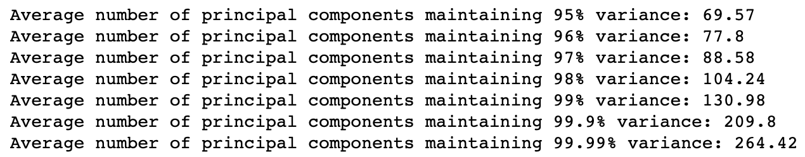

We compared accuracy of our model using different numbers of principal components based on the image above. Beginning at maintaining 95% variance, we compressed the training and validation images in our CNN model to 70x70 pixel images. We repeated this for 96%, 97%, and 98% variance: 78x78, 89x89, and 105x105, respectively. Training became too computationally expensive when we compressed images to 131x131 to maintain 99% of variance (and above). Below is a chart comparing the accuracy of models training on images of different numbers of principal components.

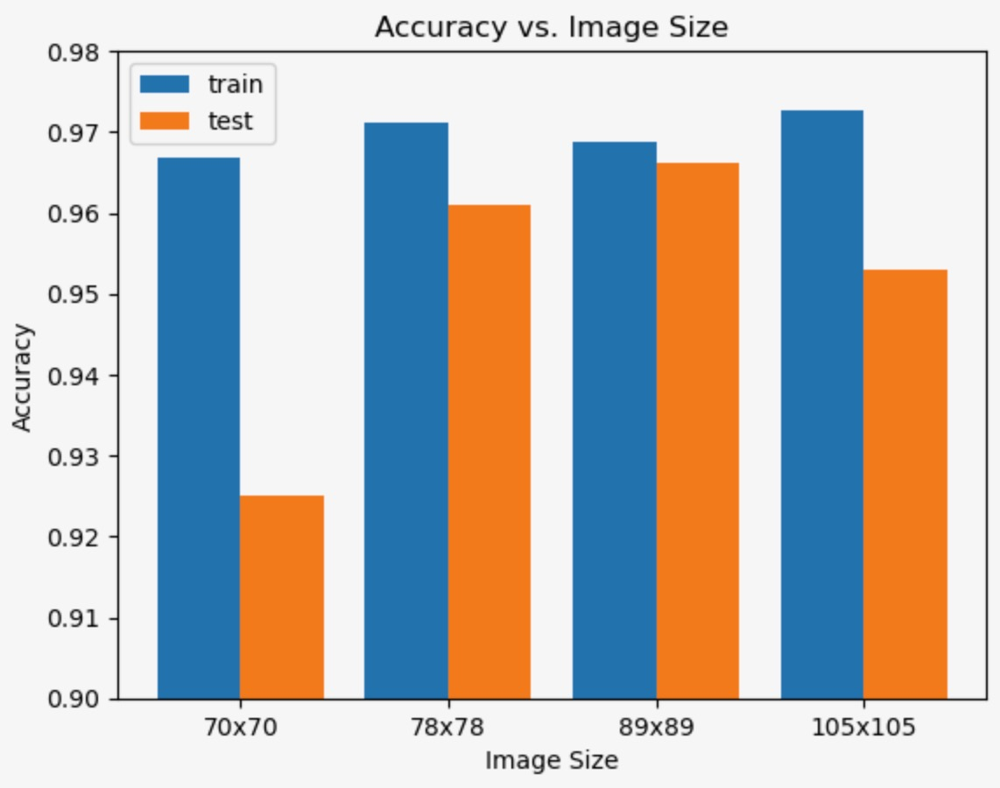

We decided to move forward with images compressed to 78x78 pixels. While testing accuracy was slightly lower than 89x89 sized images, the model was significantly less computationally expensive using 78x78 sized images. To further finely tune the model, we trained the model at different batch sizes (still with 78 principal components), which is explained in the results section.

### Convolutional Neural Network and Model Architecture
CNNs are a deep learning algorithm used in solving computer vision problems because they are designed to learn hierarchical representations of image data. CNNs contain three main layers: the convolutional, pooling, and fully connected layers. Convolution layers apply a set of filters to the input data, producing feature maps that represent the presence of different features in the input data. The pooling layer is used to downsample the feature maps. Although information is lost in the pooling layer, this layer increases efficiency and reduces complexity. The fully connected layer classifies the input data using the features found in the previous layers.

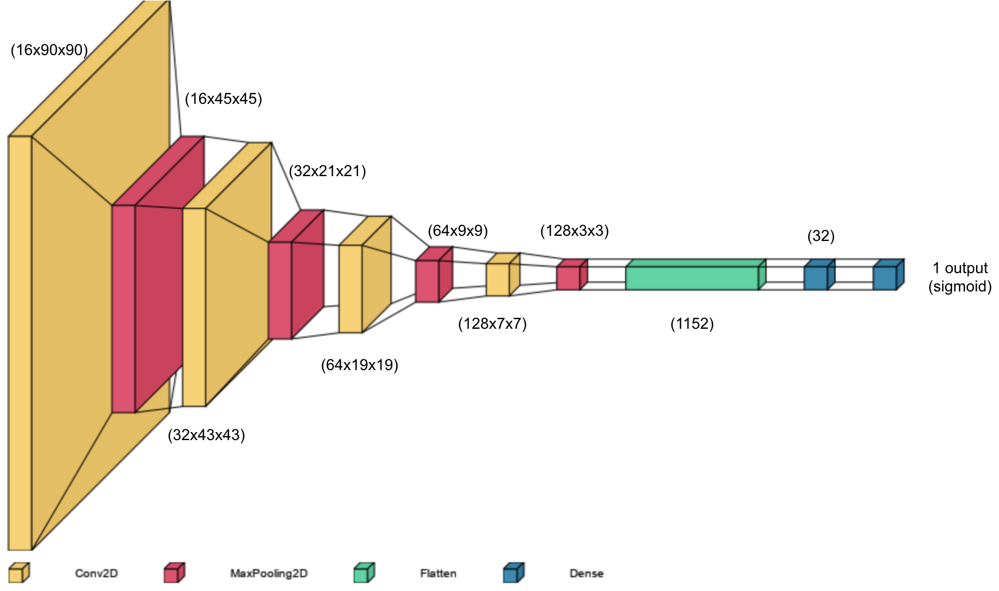

The architecture of our model is shown in the diagram above (note that the first layer in the diagram is the output shape of the first convolutional layer). We use a series of four convolutional and max pooling layers to highlight features within the satellite images while also reducing the spatial dimensions of the image. The size of the kernels used for convolving and pooling was 3x3 and 2x2, respectively, in each layer. The number of filters used in each convolutional layer are 16, 32, 64, and 128. The output is then flattened and passed to two fully connected layers in order to arrive at a single neuron output using sigmoid activation. This means that an image will be processed through the model and the output will be a 0 to 1 probability that the image is a wildfire.

This model architecture was chosen due to it’s ability to reduce the amount of trainable parameters significantly (~130k) while still maintaining a high accuracy for the binary image classification. The architecture, kernel sizes, number of filters, and model hyperparameters will be altered more over the coming weeks in order to experiment, reduce training time, and achieve higher accuracy.

## Results and Discussion
### Fine Tuning Parameters
In order to increase the effectiveness of our model, we decided to fine tune it's hyperparameters. Training our model is very computationally expensive, so rather than looping over every single combination of hyperparameters for input image size (shown above), batch size, and learning rate, we decided to isolate each individually while holding the others constant. This allowed us to only need to train 14 different models instead of 100 which would have been needed for every single combination. We acknowledge that this is a naive way of validating our hyperparameters, however we still gain valuable insight from this and end up increasing the accuracy of our model.

For batch size, we trained a model taking in 78x78 input images for 30 epochs using batch sizes of 32, 64, 128, 256, 512. As we can see from the plot above, we obtain the highest testing accuracy from the model using a batch size of 64. Therefore we will now accept this as the best value for batch size.

For learning rate, we trained identical models by only altering the learning rate of the optimizer over the values 0.0001, 0.0005, 0.001, 0.005, 0.01. As can be seen from the plot above, the model using a learning rate of 0.0005 resulted in the highest testing accuracy.

### Final Model
Training the different models with different hyperparameters to identify which resulted in the highest accuracy while leaving computational costs relativley low resulted in our final model have input image size of 78x78, batch size of 64, learning rate of 0.0005, and training it for 30 epochs. This final model yielded a classification accuracy of 97.34% and an average training time of only 3 minutes per epoch on average.

As can be seen from the model, over our training epochs the accuracy increases until tampering our and our loss decreases until it begins to flatline also. We think the jagged nature of our validation curve is no cause for concern because the fluctuations are on such a small range and the overall trend of the curve is what is to be expected. After training and testing our final model, a confusion matrix was created to better visualize the strengths and shortcomings of the model.

As shown, the model doesn't appear to be biased towards selecting one classification over another. The almost equal number of samples across the corners of the matrix reaffirm this statement. 

## References
[1] Aaba, Abdelghani. (2023). Wildfire Prediction Dataset (Satellite Images). Retrieved 22 February 2023 from https://www.kaggle.com/datasets/abdelghaniaaba/wildfire-prediction-dataset.  
[2] Czakon, J. (2023, January 31). 24 evaluation metrics for binary classification (and when to use them). neptune.ai. Retrieved February 23, 2023, from https://neptune.ai/blog/evaluation-metrics-binary-classification.  
[3] Garthwaite, J. (2022, Sept. 22). Stanford researchers find wildfire smoke is unraveling decades of air quality gains, exposing millions of Americans to extreme pollution levels [Online]. Available: https://news.stanford.edu/2022/09/22/wildfire-smoke-unraveling-decades-air-quality-gains/.  
[4] Harvey BJ, Donato DC, Turner MG. Burn me twice, shame on who? Interactions between successive forest fires across a temperate mountain region. Ecology. 2016 Sep;97(9):2272-2282. doi: 10.1002/ecy.1439. PMID: 27859087.  
[5] S. Albawi, T. A. Mohammed and S. Al-Zawi, "Understanding of a convolutional neural network," 2017 International Conference on Engineering and Technology (ICET), Antalya, Turkey, 2017, pp. 1-6, doi: 10.1109/ICEngTechnol.2017.8308186.  
[6] United States Environmental Protection Agency. (2023, March 11). Climate Change Indicators: Wildfires [Online]. Available: https://www.epa.gov/climate-indicators/climate-change-indicators-wildfires
[7] Wasnik, Abhishek. (2020, Oct. 19). Principal Component Analysis For Image Data in Python. AskPython. Retrieved 30 March, 2023, from https://www.askpython.com/python/examples/principal-component-analysis-for-image-data.  
[8] World Health Organization. (n.d.). Wildfires. World Health Organization. Retrieved February 23, 2023, from https://www.who.int/health-topics/wildfires#tab=tab_2.  
## Proposed Timeline
* 2/25-3/3: Finalize model 1 data preprocessing and feature reduction, research CNNs
* 3/4-3/11: Implement first supervised model
* 3/18-3/30: Model 1 analysis, tuning, initial evaluation
* 3/31: Midpoint report due
* 4/1-4/8: Model 2 selection, data cleaning, and implementation
* 4/9 - 4/17: Comparison, visualization, validation, and testing of models 1 & 2
* 4/18 - 4/24: Results evaluation & report writing
* 4/25: Final project due  

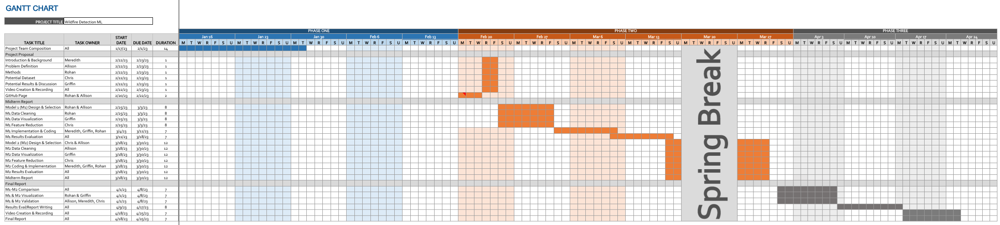

## Contributions
* Chris Burgett: Convolutional Neural Network Report Section, CNNs and Model Architecture Presentation
* Griffin Gillespie: Results and Discussion Report Section, Final Model Results Presentation
* Allison Leyden: Problem Definition Report Section, Dimensionality Reduction (PCA), Data Collection and PCA Presentation
* Meredith Rush: Introduction/Background Report Section, Background and Problem Definition Presentation
* Rohan Srivastava: Data Collection and Data Preprocessing Report Sections, CNN Model, Evaluation Metrics, Parameter Tuning Presentation
